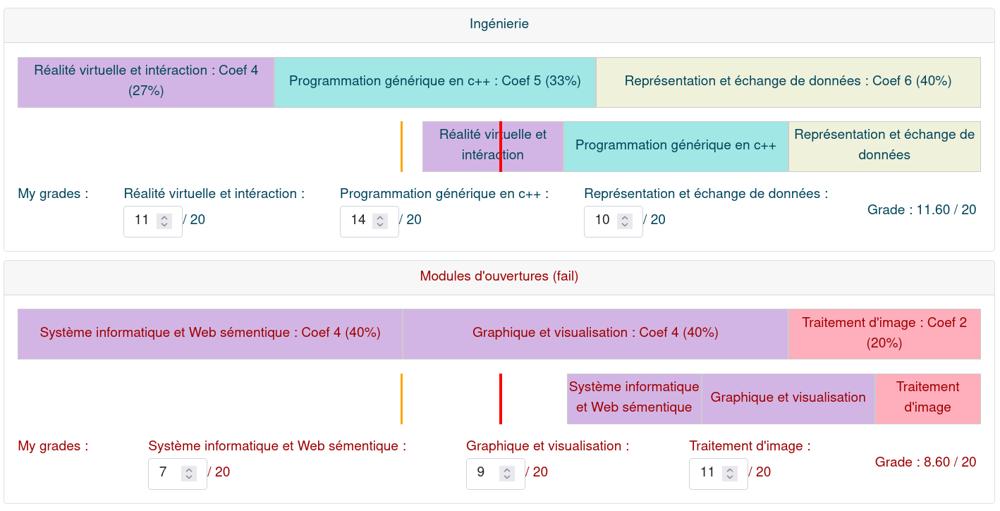

# Polytech coef simulator
 [](https://opensource.org/licenses/MIT)
 [](https://opensource.org/licenses/MIT)


Made with VueJs
## Setting your own coef

Just change the src/assets/coef.yaml file

## Run with Docker

```bash
# Build
docker build -t polytech_coef_simulator .
```

```bash
# Run
docker run -it polytech_coef_simulator:latest -p 8080:8080
```


## Dev setup
```
git clone git@github.com:Tomansion/Polytech-coef-simulator.git
```
```
cd Polytech-coef-simulator
```
```
npm install
```
```
npm run serve
```

### Compiles and minifies for production
```
npm run build
```
